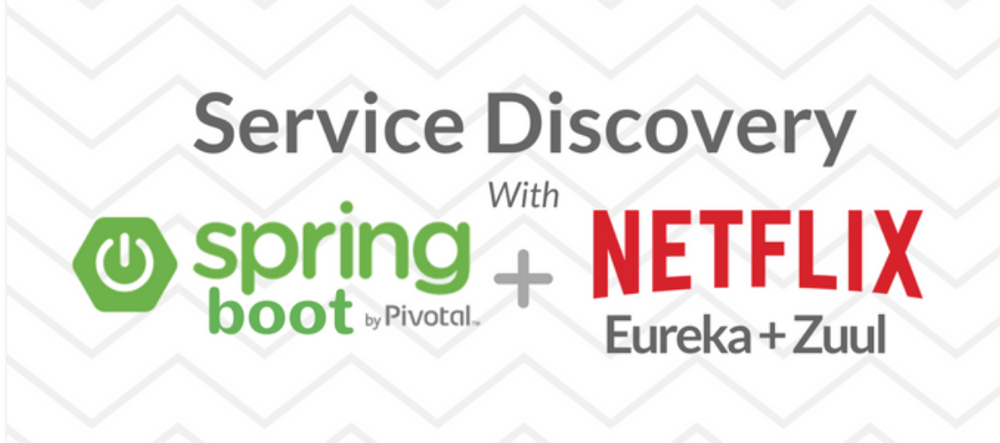
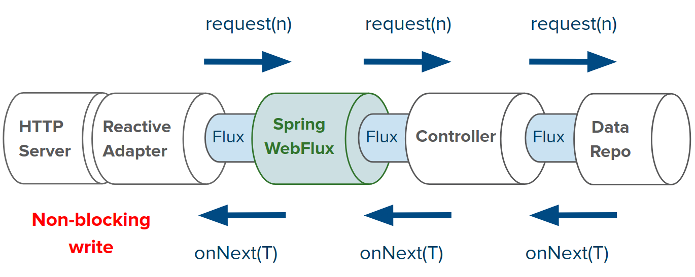
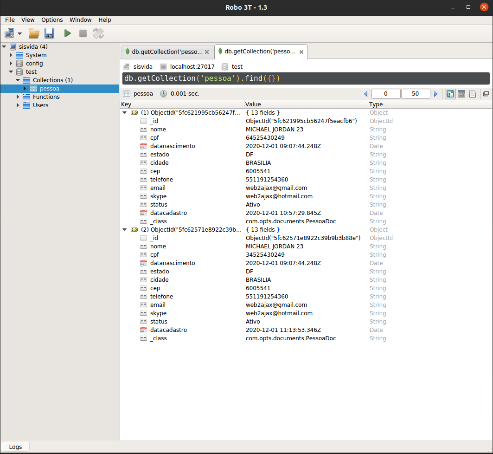
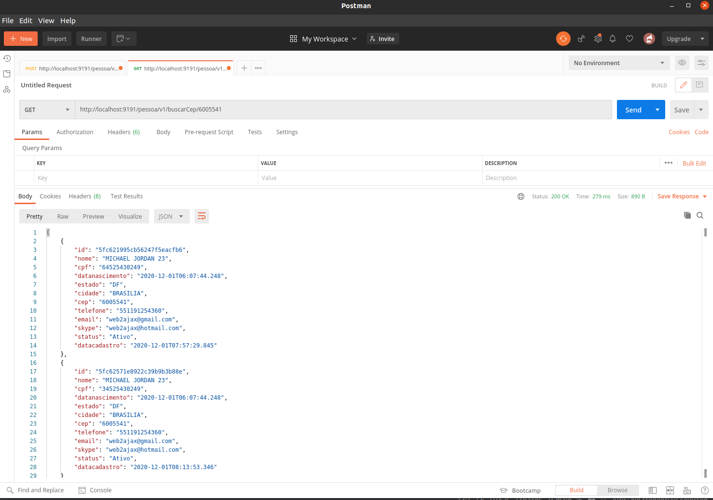
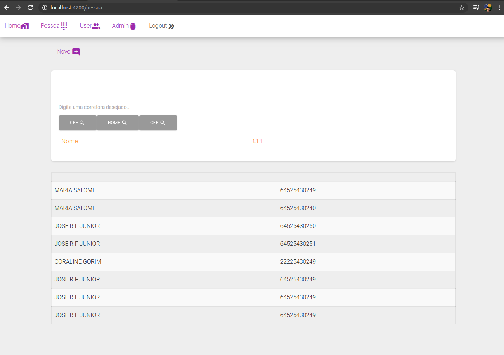
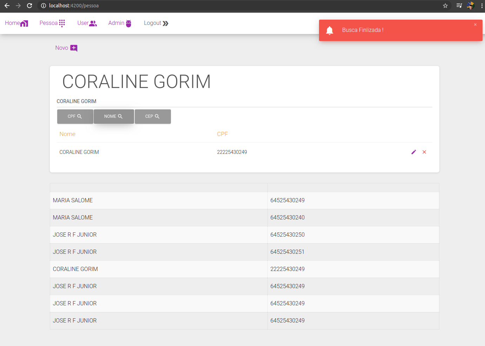
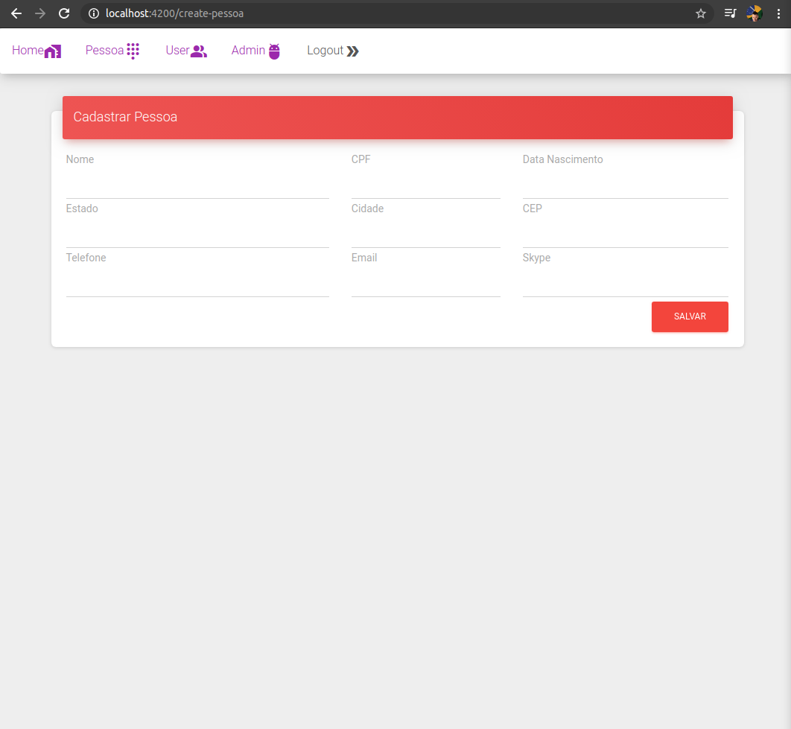
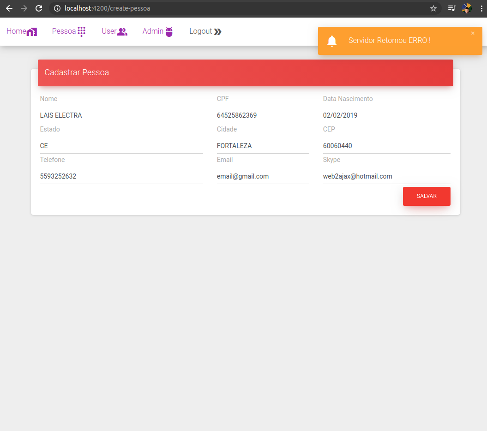
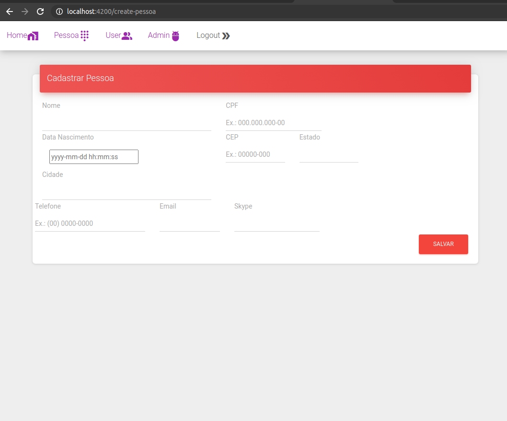

# OptimumSupply

0 - Commons

1 - GatewayApplication

2 - EurekaApplication

3 - OptsApplication (mongo)  : #Java-MongoDB-WebFlux-SpringBoot-Eureka-Zuul

4 - OptsApplication (postgres) : #Java-Postgres-WebFlux-SpringBoot-SpringSecurity

 -- Dados start para autenticar
 -- usuario: admin senha: admin
 
    -- 1,admin,admin,{bcrypt}$2a$10$62G2DfTMpiQasT4WwbDXUuJly3pZYUVRn/qYbQA7PV5yTSkS6SGTe,"ROLE_ADMIN,ROLE_USER"

5 - OptsApplication (postgres) : #Java-Postgres-JDBC-SpringBoot

6 - Front End - Angular 9

-------------------------------------------------------------------------------------------------------------------
    

